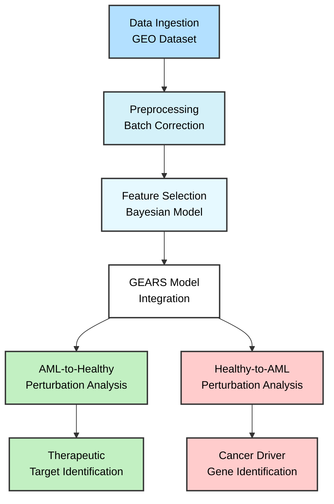
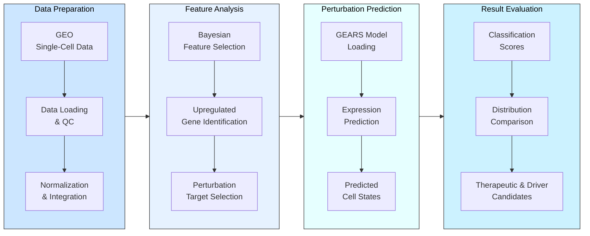
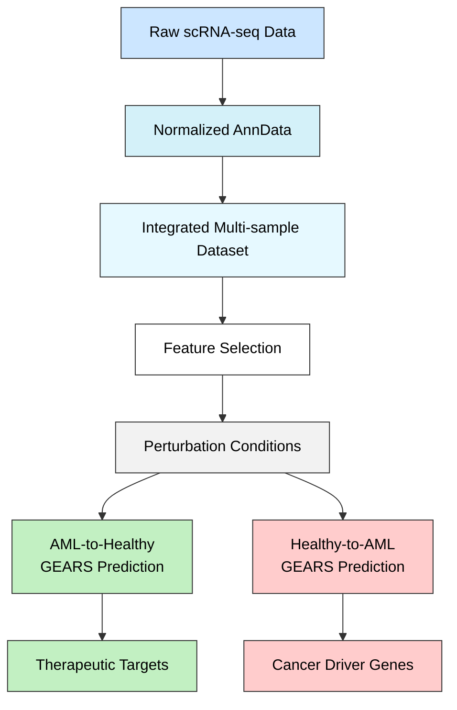

# ML-AML: Acute Myeloid Leukemia Perturbation Analysis

## Overview

ML-AML is a computational biology project that analyzes single-cell RNA sequencing data from acute myeloid leukemia (AML) patients to identify potential therapeutic targets and cancer driver genes. The pipeline uses machine learning and perturbation analysis to discover:

1. Gene targets that could potentially convert malignant cells to a healthier state (AML-to-healthy)
2. Cancer driver genes that could transform healthy cells into an AML-like state (healthy-to-AML)

This bidirectional analysis provides insights into both therapeutic interventions and cancer mechanisms.

## Data Flow and Architecture

The project follows a sequential workflow:



### Detailed Process Flow



## Key Components

### 1. Data Ingestion
- Loads AML scRNA-seq data from GEOparse (GSE116256)
- Separates samples into AML, healthy controls, and cell lines
- Handles multiple data formats and annotation files

### 2. Preprocessing
- Normalizes gene expression data
- Performs batch correction (e.g., using Harmony on the PCA embedding) across samples to mitigate technical variation for visualization and clustering.
- Creates integrated AnnData objects
- Applies quality control filters

### 3. Feature Selection
- Uses `BayesianFeatureSelector` on the normalized, log-transformed gene expression matrix (`adata.X` or `adata.raw.X`) to identify differentially expressed genes between conditions (e.g., malignant vs. normal).
- **Prior Specification:** The model employs a hierarchical Bayesian approach. Specifically, it uses a **shrinkage prior (Horseshoe-like)** on the gene coefficients (`beta`). This involves:
    - A global scale parameter (`tau_0` ~ HalfCauchy) influencing overall sparsity.
    - Local, feature-specific scale parameters (`lam` ~ HalfCauchy, `c2` ~ InverseGamma) allowing important features to have larger coefficients while strongly shrinking noise features towards zero.
    - This prior structure helps adaptively identify relevant genes from high-dimensional expression data.
- Focuses on genes upregulated in malignant cells
- Employs probabilistic programming (Pyro) for robust feature importance estimation based on the posterior distribution of coefficients.

### 4. GEARS Model Integration
- Utilizes pre-trained GEARS model for perturbation prediction
- Prepares data through its `PertData` framework
- Simulates gene knockdown effects in silico

### 5. Perturbation Evaluation
- Simulates the effects of gene knockdowns on cell state in two directions:
  - AML-to-healthy: Identifying genes that restore healthy cell state
  - Healthy-to-AML: Identifying potential cancer driver genes
- Computes metrics like:
  - Classifier score (predicting healthy vs. malignant state)
  - Wasserstein distance to reference cells
  - Expression stability score
  - Local density estimation

### 6. Patient-Specific Analysis
- Trains classifiers for individual patients
- Evaluates perturbation effects on patient-specific data
- Identifies personalized therapeutic targets

## Dependencies

### Core Python Modules
- `feature_selection.py`: Bayesian model for gene feature selection
- `perturbation_evaluator.py`: Framework for evaluating perturbation efficacy
- `gears_pertdata.py`: Custom data handler for GEARS model

### External Libraries
```
numpy
pandas
pyro-ppl
scikit-learn
scipy
torch
matplotlib
mlflow
tqdm 
geoparse
anndata
torch_geometric
cell-gears
plotly
```

## Getting Started

1. Clone the repository
   ```bash
   git clone https://github.com/yourusername/ML-AML.git
   cd ML-AML
   ```

2. Set up a virtual environment
   ```bash
   # Using Python's built-in venv
   python -m venv venv
   
   # Activate the virtual environment
   # On macOS/Linux:
   source venv/bin/activate
   # On Windows:
   venv\Scripts\activate
   
   # You should see (venv) at the beginning of your terminal prompt
   # indicating that the virtual environment is active
   ```

3. Install dependencies
   ```bash
   pip install -r requirements.txt
   ```

4. Download the pretrained GEARS model (if not included)
   ```bash
   # The notebook will automatically download this if needed
   ```

5. Launch the notebook
   ```bash
   jupyter notebook ml-aml.ipynb
   ```

The `ml-aml.ipynb` notebook serves as the primary entry point and contains step-by-step execution of the entire pipeline.

## Data Flow Details



1. **Raw Data → Processed AnnData**:
   - Single-cell gene expression matrices (.dem.txt.gz) and annotations (.anno.txt.gz) are loaded
   - Normalized and batch-corrected into an integrated AnnData object

2. **AnnData → Feature Selection**:
   - Expression matrices are fed into the Bayesian feature selector
   - Selected genes become candidates for perturbation analysis

3. **Selected Features → Perturbation Conditions**:
   - Top features are used to generate single and combination perturbations

4. **Perturbations → GEARS Predictions**:
   - GEARS model predicts gene expression changes after perturbation
   - Bidirectional analysis:
     - AML cells perturbed toward a healthy state
     - Healthy cells perturbed toward an AML-like state

5. **Predictions → Evaluation Metrics**:
   - Classifier determines if perturbed state resembles target state
   - Distance metrics quantify overall similarity to reference state

6. **Evaluation → Target Identification**:
   - For AML-to-healthy: Identifies potential therapeutic targets
   - For healthy-to-AML: Identifies potential cancer driver genes
   - Results are saved for further analysis

## Advanced Usage

### Bidirectional Perturbation Analysis
The framework supports both directions of analysis:
```python
# AML to healthy direction (therapeutic target discovery)
evaluator = PerturbationEvaluator(
    classifier=selector,
    reference_state=healthy_adata,  # healthy reference
    device=device,
    invert_classifier_score=True,  # invert scores to prefer healthy-like state
)
results = evaluator.evaluate_perturbations(cancer_adata, perturbation_list)

# Healthy to AML direction (cancer driver discovery)
evaluator = PerturbationEvaluator(
    classifier=selector,
    reference_state=cancer_adata,  # cancer reference
    device=device,
    invert_classifier_score=False,  # don't invert scores to identify cancer-promoting genes
)
results = evaluator.evaluate_perturbations(healthy_adata, cancer_driving_perturbations)
```

### Patient-Specific Analysis
The pipeline can be customized for individual patient samples:
```python
# Example from the notebook
patient_selector = BayesianFeatureSelector(
    unique_id=hash(patient_id) % 10000,
    verbose=True,
    lr=0.0001,
    max_features=1000
)
patient_selector.fit(patient_expr_df, patient_labels)
```

## Notes

- This is a research project, not a clinical tool
- GPU acceleration is recommended for the GEARS model inference
- Large datasets may require significant memory resources

## Contributing

Contributions are welcome! Please follow these steps:

1. Fork the repository
2. Create a feature branch (`git checkout -b feature/amazing-feature`)
3. Commit your changes (`git commit -m 'Add some amazing feature'`)
4. Push to the branch (`git push origin feature/amazing-feature`)
5. Open a Pull Request

## License

This project is licensed under the MIT License.